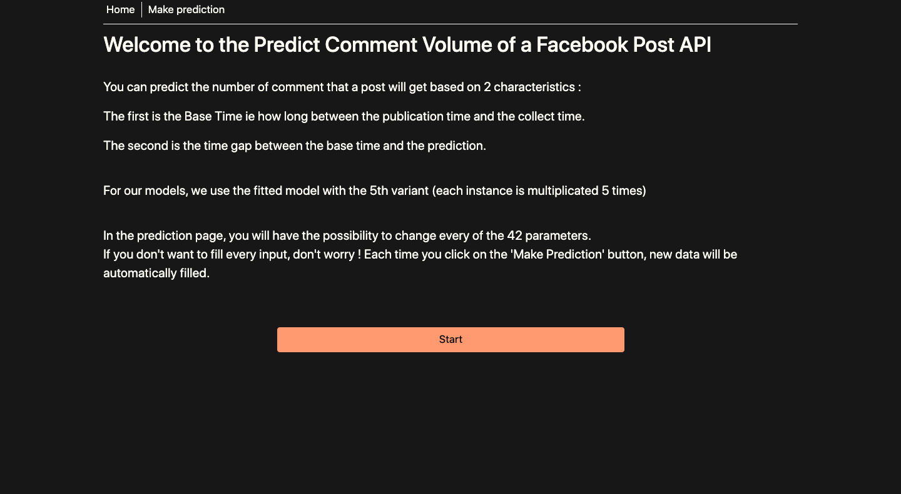
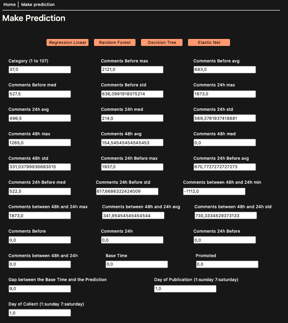
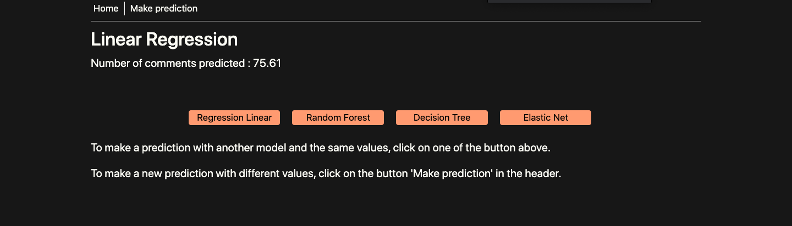
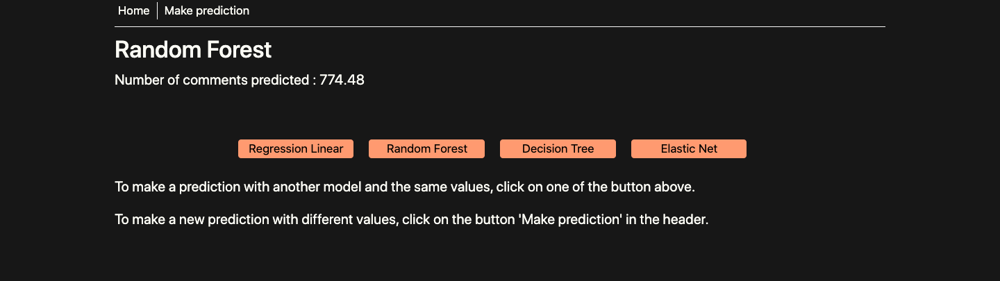
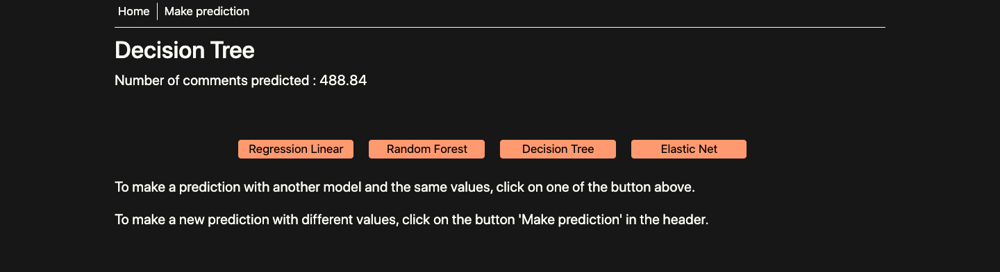
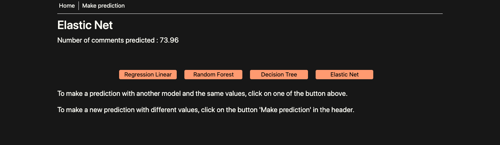

# Python For Data Analysis
# Facebook Comment Volume Prediction Dataset

* Léa Wong 

# Objectives

The main objectif of this data set is to predict the number of comments for a Facebook post for the X next hours

# Description of the dataset

Comments picked on several Facebook pages

Data are pre-treated:
—> no comments older than 3 days before de data collect
—> no incomplete data

Dataset split into 5 files corresponding to the number of data collecting base time for each post.

## More information about Base Time variable

Data are collected based on a X multiplier (from 1 to 5).
For each variant, we find X instances of each post with different base times. 

Since the number of final comment is known, the author wanted to add difficulty, by adding the ‘hrs’ variable, corresponding to a random integer between 1 and 24. This indicates the time gap between the base time and the prediction.

## Cleaning of the data

Originally, there are 53 numerical variables in this dataset.  
1 number of likes on the page  
2 page checkings  
3 number of returns on the page  
4 page Category  
5-29 min, max, average, median and standard deviation of essential features  
30 total number of comments before selected base date/time  
31 number of comments in last 24 hours, relative to base date/time  
32 number of comments in last 48 to last 24 hours relative to base date/time  
33 number of comments in the first 24 hours after the publication of post but before base date/time  
34 difference between 31 and 32  
35 base time  
36 post length  
37 post share count  
38 post promotion status -whether the post is promoted(1) or not(0)- 
39 hrs -H hrs, for which we have the target variable/ comments received  
40-46 post published weekday  
47-53 base DateTime weekday

## Warning

To test the ipnyb code, you must first unzip the Dataset file, containing the train files but also the different test cases given by author (10 in total)

# Machine Learning models selected

I selected 4 models to make prediction with this dataset :

* Linear Regression : LinearRegression fits a linear model with coefficients w = (w1, …, wp) to minimize the residual sum of squares between the observed targets in the dataset, and the targets predicted by the linear approximation. [Learn More Here](https://scikit-learn.org/stable/modules/generated/sklearn.linear_model.LinearRegression.html "Learn More Here").

* Random Forest Regressor : A random forest is a meta estimator that fits a number of classifying decision trees on various sub-samples of the dataset and uses averaging to improve the predictive accuracy and control over-fitting. The sub-sample size is controlled with the max_samples parameter if bootstrap=True (default), otherwise the whole dataset is used to build each tree. [Learn More Here](https://scikit-learn.org/stable/modules/generated/sklearn.ensemble.RandomForestRegressor.html "Learn More Here").

* Decision Tree Regressor : The decision trees is used to fit a sine curve with addition noisy observation. As a result, it learns local linear regressions approximating the sine curve. [Learn More Here](https://scikit-learn.org/stable/auto_examples/tree/plot_tree_regression.html#sphx-glr-auto-examples-tree-plot-tree-regression-py "Learn More Here").

* Elastic Net : Elastic net is a popular type of regularized linear regression that combines two popular penalties, specifically the L1 and L2 penalty functions. [Learn More Here](https://scikit-learn.org/stable/modules/generated/sklearn.linear_model.ElasticNet.html "Learn More Here").

## Grid Search results

To find the best hyper parameters for my models, I implemented a search grid with Grid Search.  
Here are the results : 

* Linear Regression : 
‘fit_intercept’ : False,  ‘normalize’ : True

* Random Forest :
‘max_depth’ : 10, ‘max_features’ : 'auto', ’n_estimators’ : 50

* Decision Tree :
‘max_depth’ : 6, ‘criterion’ : ‘friedman_mse',  ‘max_features’ : 'auto'

* Elastic Net :
‘alpha’ : 6, ‘l1_ratio’ : 6

# Web API

My web API was made using Flask.  

Data are pre-filled but can be manually changed by the user.

## Warning

Before using this API, you must unzip the Random forest model in the file ./flask/models

Main page :  

Data filling page:  

Result page:  

